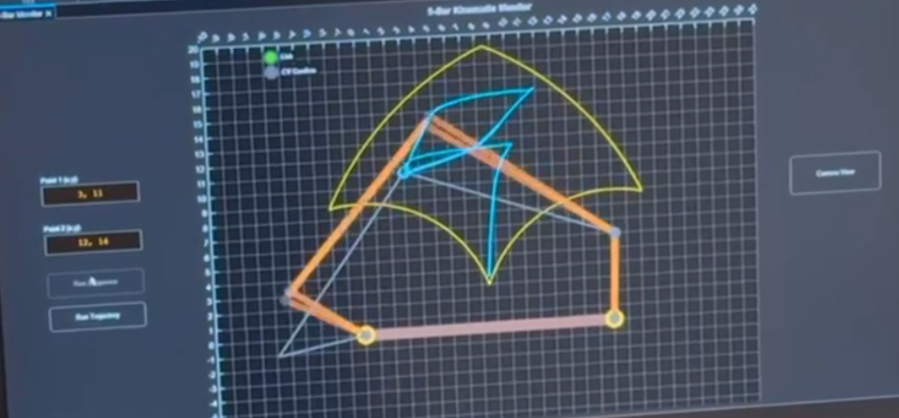
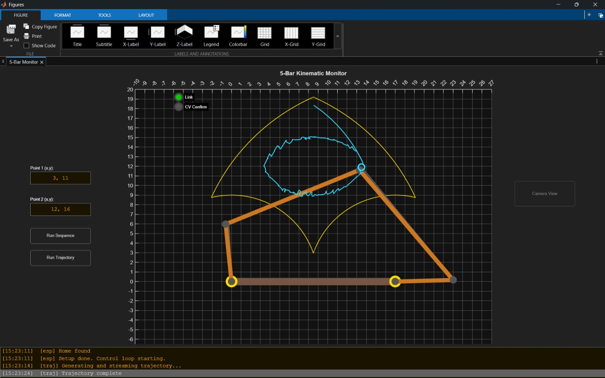
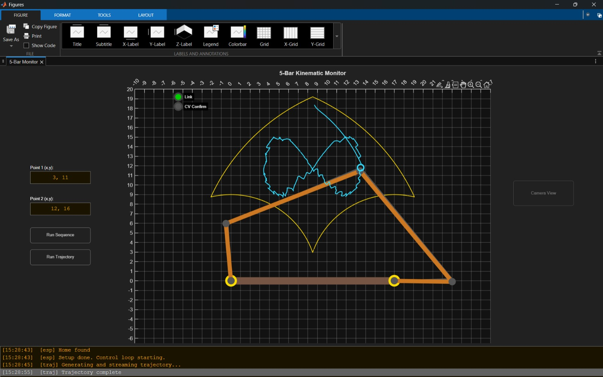
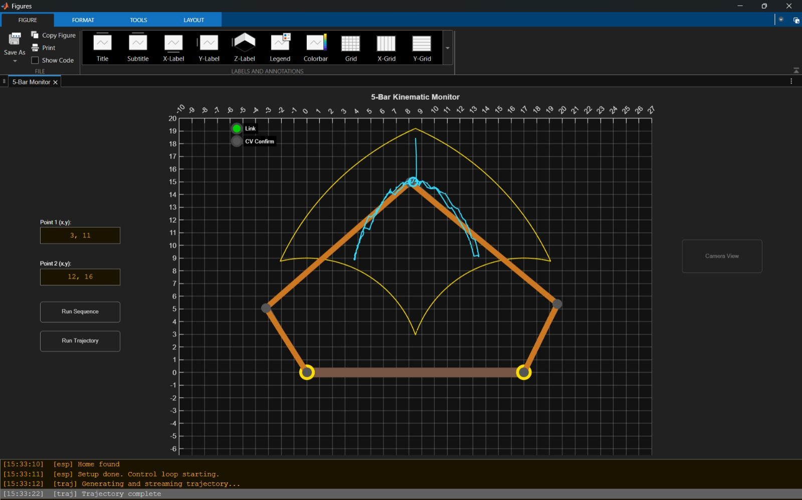
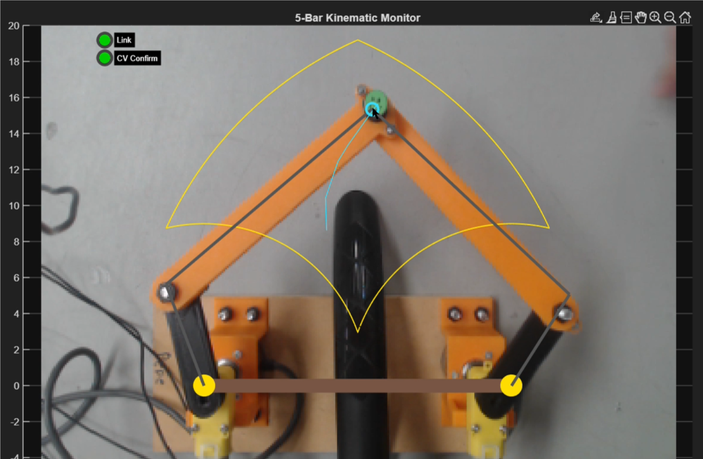
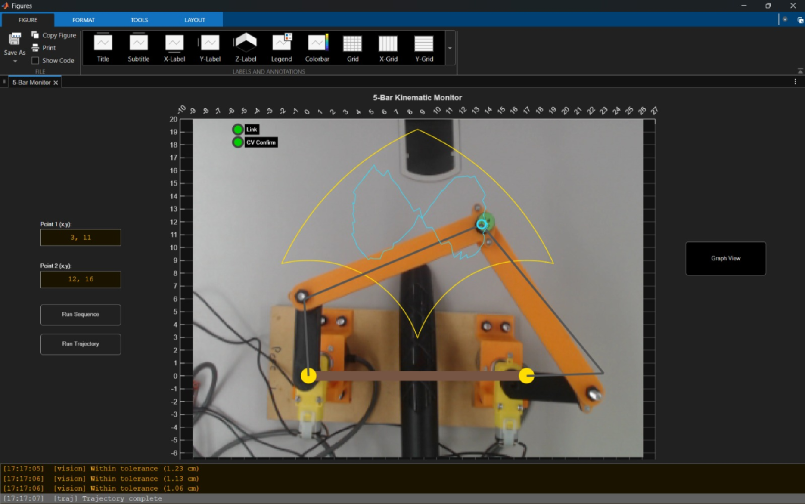

# 5-Bar-Parallel-Robot
Implementation of a control system for a 5-bar parallel robot.

## Project Description ##
The project involves the implementation of a control system for a 5-bar parallel robot. The robot’s primary function is to perform pick-and-place tasks at any point within its workspace.

As for the electronics, an ESP32 S3, E6B2-CWZ6C rotary encoders, gearmotors, and an L298N driver were used. It is worth noting that the control system architecture was based on a PD controller, as it did not require an integrator—since the motors already act as a natural integrator—and gravity compensation was also unnecessary due to the way the prototype was constructed.

The project interface was designed in MATLAB, while the ESP32 sent information to MATLAB via serial communication using UDP. 

Computer vision was also implemented to determine whether the end-effector was reaching the position indicated by the system. For the computer vision, a “[please insert the name of the webcam]” was used, and the end-effector—which was a green object—was detected using HSV.

## MATLAB Interface
### Pick-and-place task

### Path Planning

## Computer Vision
### Position confirmation using computer vision

### Trajectory tracking

## Demonstration video
The video demonstrating the robot can be found at the following link: https://drive.google.com/file/d/1ZcIkjBZ2Dqtx1aF6IGFKVym0vXRFdFLP/view?usp=sharing
